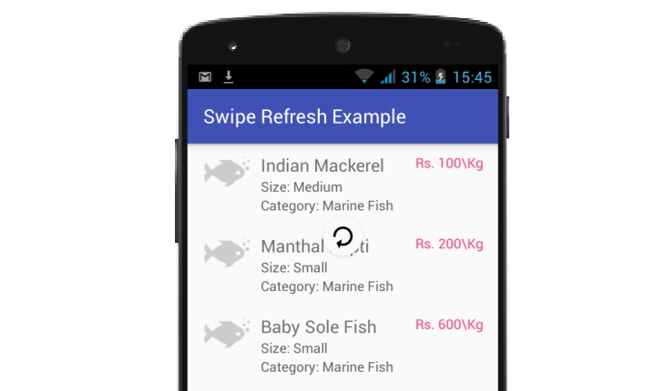

# Android Swipe Refresh Layout with RecyclerView

Fetch fresh data from PHP or JSON file by swipe down to refresh RecyclerView, using Swipe Refresh Layout in android. For Tutorial  http://androidcss.com/android/android-swipe-refresh-layout/
